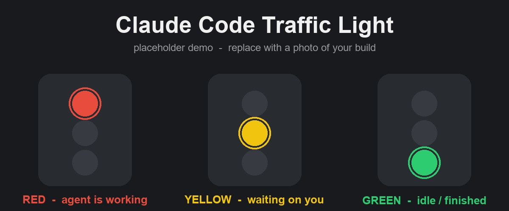

# Claude Code Traffic Light 🚦

[](LICENSE)
[](https://www.anthropic.com/claude-code)

A physical desk light that shows you what Claude Code is doing — at a glance,
from across the room.

Claude Code can run shell commands at key moments in its lifecycle (these are
called **hooks**). This project hangs a tiny script on those hooks so a real
light on your desk changes color as the agent works:

- 🔴 **Red** — the agent is working (you just submitted a prompt)
- 🟡 **Yellow** — the agent is waiting on you (it needs a permission or input)
- 🟢 **Green** — the agent is idle or finished (session start, or it just stopped)

No more babysitting the terminal. Glance at the light, get on with your day.



> 📸 **Drop a photo or GIF of your build into the `images/` folder** and name it
> `demo.jpg` — it'll show up right here.

## Two ways to build it

| Path | Hardware | Soldering? | Best for |
| --- | --- | --- | --- |
| **ESP32 + LEDs** (the hero build) | ~$10–15 of parts | No (breadboard) | Tinkerers who want the real thing |
| **USB busy light** (no-solder) | Any Luxafor / Kuando / Embrava light | No | "I just want it working now" |

Both paths use the **exact same hooks** — only the script differs.

## How it works

Claude Code fires a **hook** at certain lifecycle events. A hook just runs a
shell command. We point each event at one small script, `light.sh`, and hand it
a color:

```
hook event fires  →  runs light.sh <color>  →  flips the light
```

That's the whole idea. The light is **fully decoupled** from the agent: the
script can talk to an ESP32, a USB light, a smart bulb — anything. Swap the
script, keep the hooks.

| Hook event        | Meaning                         | Color   |
| ----------------- | ------------------------------- | ------- |
| `SessionStart`    | A session started               | 🟢 green |
| `UserPromptSubmit`| You sent a prompt; agent working| 🔴 red   |
| `Notification`    | Agent is waiting on you         | 🟡 yellow|
| `Stop`            | Agent finished responding       | 🟢 green |

Because hooks are fire-and-forget signals, the scripts **always exit 0** and use
short timeouts — a powered-off light can never block or break the agent.

## Parts list (ESP32 path)

| Part | Rough price |
| --- | --- |
| ESP32 dev board | ~$6 |
| 3 × 5 mm LEDs (red, yellow, green) | ~$1 |
| 3 × 220 Ω resistors | ~$1 |
| Breadboard | ~$3 |
| Jumper wires | ~$2 |
| USB cable | you probably have one |
| **Total** | **~$10–15** |

Full wiring instructions, including LED polarity and resistor notes, are in
[`docs/wiring.md`](docs/wiring.md).

## Setup — ESP32 path

1. **Flash the firmware.** Open `firmware/traffic_light/traffic_light.ino` in the
   Arduino IDE (or PlatformIO). Set `WIFI_SSID` and `WIFI_PASSWORD` at the top to
   your network, select your ESP32 board, and upload.
2. **Read the IP.** Open the Serial Monitor at **115200 baud** and reset the
   board. It prints its IP address, e.g. `192.168.1.123`.
3. **Set `LIGHT_IP`.** Open `scripts/light.sh` and put that IP in the `LIGHT_IP`
   line near the top.
4. **Install the script.** Copy it into your Claude config directory:
   ```bash
   cp scripts/light.sh ~/.claude/light.sh
   chmod +x ~/.claude/light.sh
   ```
5. **Add the hooks.** Merge the contents of `settings.example.json` into
   `~/.claude/settings.json` (under the `"hooks"` key — keep any hooks you
   already have).
6. **Wire it up.** Follow [`docs/wiring.md`](docs/wiring.md).
7. **Test it:**
   ```bash
   ~/.claude/light.sh red
   ~/.claude/light.sh yellow
   ~/.claude/light.sh green
   ~/.claude/light.sh off
   ```
   Each command should change the light. Now start Claude Code and watch it
   react on its own.

## Setup — no-solder path (USB busy light)

1. **Install the driver:**
   ```bash
   pip install busylight-for-humans
   ```
2. **Install the script** (note we rename it to `light.sh`):
   ```bash
   cp scripts/light-busylight.sh ~/.claude/light.sh
   chmod +x ~/.claude/light.sh
   ```
3. **Add the hooks** — same as above: merge `settings.example.json` into
   `~/.claude/settings.json`.
4. **Test it:**
   ```bash
   ~/.claude/light.sh red
   ~/.claude/light.sh off
   ```

Same four hooks, same colors — just a different light underneath.

## Troubleshooting

- **The light never changes.** Test the script by hand first:
  `~/.claude/light.sh red`. If that works but Claude Code doesn't trigger it,
  re-check that `settings.example.json` was merged correctly into
  `~/.claude/settings.json` and that `~/.claude/light.sh` is executable.
- **The hook hangs / the board seems to stall things.** Double-check `LIGHT_IP`
  is correct and that `light.sh` uses a curl timeout (it ships with
  `--max-time 2`). A powered-off board should fail fast, never hang.
- **Yellow rarely shows up.** That's normal. The `Notification` hook only fires
  when the agent actually pauses for you (a permission prompt or input request),
  which doesn't happen on every turn.

## Extend it

The script is the only thing that knows about hardware, so the same pattern
works for almost any light:

- **Smart bulb** (Philips Hue, LIFX, Govee): replace each branch of `light.sh`
  with a call to that bulb's CLI or HTTP API.
- **LED strip** (WS2812 / NeoPixel): point the ESP32 firmware at the strip and
  set a color per request instead of toggling three pins.

As long as your script accepts `red` / `yellow` / `green` / `off` and exits 0,
the hooks don't care what's on the other end.

## A note on secrets

Wi-Fi credentials in the firmware are obvious placeholders — replace them with
your own, but **don't commit real ones**. The `.gitignore` already excludes
common secret files (`*.local`, `secrets.*`, `.env`). If you'd rather not keep
credentials in the sketch at all, move them into a separate, gitignored header
and `#include` it.

## Acknowledgements

<!-- Add a personal thank-you line here — people, tutorials, or projects that helped. -->
_Built for the Claude Code community. Thanks for taking a look!_

## License

MIT — see [LICENSE](LICENSE). © 2026 Shahzad Asghar.
